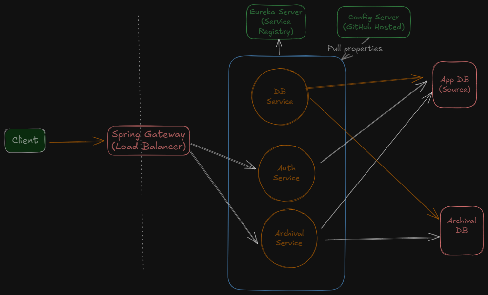

# Archival Service

## Overview
The **Archival Service** is a distributed **microservice-based** application designed to manage **data archiving** within a multi-service architecture. This system ensures **data integrity, security, and immutability** by transferring records from active application databases to a separate **archival database** based on predefined criteria. Built using **Spring Boot** and **Spring Cloud**, the application leverages **service discovery, gateway routing, and authentication** to provide a seamless archiving solution.

## Architecture
The application follows a **microservices** architecture, comprising several independent services:

- **Service Registry (Eureka Server):** Provides **service discovery**, allowing microservices to dynamically locate and communicate with each other.
- **Gateway Service:** Acts as an **API gateway**, routing incoming requests to the appropriate microservices and handling **JWT authentication**.
- **Auth Service:** Manages **user authentication** and **JWT token generation**.
- **Archival Service:** Handles **archival configuration, execution, and user table assignments**.
- **DB Service:** Manages the **database schema** and ensures consistency using the **Flyway migration tool**.

- **Properties of each service is derived from - https://github.com/naveengujjar29/archival-project-config-repo config project.**




---
## Key Design Decisions

### Database Design
#### Approach
The system utilizes **two PostgreSQL databases**:

1. **Application Database (`archival-app`)** – Stores active application data (e.g., `student` table). It also has the user sign-up details and configuration settings.
2. **Archival Database (`archival_db`)** – Stores archived data (e.g., `student_archive` table).

Schema migrations are handled using **Flyway**, ensuring consistency across both databases.

## Key Design Decisions

### Archival Process
#### Approach
The Archival Service periodically moves data from the application DB to the archival DB based on configurable rules stored in the `archival_criteria` table. The process follows these steps:
- **Selection**: Identify records older than the `archiveAfter` value based on the `created_at` column.
- **Archival**: Move selected records to the archival DB.
- **Cleanup**: Optionally delete records from the application DB after the configured `deleteAfter` period.

#### Assumptions
- All tables to be archived must include a `created_at` timestamp column.
- The archival process is designed for small to medium datasets. Batch processing may be required for large datasets.

#### Key Decisions
##### Choice of PostgreSQL
The decision to use PostgreSQL for both the Application Database (`archival-app`) and Archival Database (`archival_db`) was driven by several key factors:

- **Robust Transactional Support**
  - Full ACID compliance ensures reliable data movement.
  - Prevents data loss or corruption during archival.
- **Advanced Schema Management with Flyway**
- **Open-Source and Cost-Effective**
- **Community Support and Maturity**
  - Large ecosystem with long-term support.

##### Comparison with Other Database Options
The following table compares PostgreSQL with other databases considered for the Archival Service:

| **Database**      | **Pros**                                                                                   | **Cons**                                                                                     |
|-------------------|-------------------------------------------------------------------------------------------|---------------------------------------------------------------------------------------------|
| **PostgreSQL**    | - Full ACID compliance ensures transactional integrity <br>- Seamless Flyway integration for schema migrations <br>- Extensible with custom functions and indexes <br>- Open-source and cost-effective <br>- Strong community support | - Higher performance overhead for very large datasets <br>- Steeper learning curve for advanced features |
| **MySQL**         | - Good performance for read-heavy workloads <br>- Strong community support <br>- Flyway compatible for migrations | - Lacks advanced JSONB support <br>- Less robust transactional support in replication scenarios <br>- Limited extensibility compared to PostgreSQL |
| **MongoDB**       | - Ideal for unstructured data <br>- Highly scalable with horizontal scaling <br>- Flexible schema design | - Limited ACID support (recent versions only) <br>- Schema-less design complicates `created_at` enforcement <br>- Not ideal for structured archival data |
| **SQLite**        | - Lightweight and embedded <br>- No server setup required <br>- Simple to use | - Not suited for distributed systems or high concurrency <br>- Lacks replication and scaling options <br>- Limited support for Flyway migrations |
| **Amazon RDS (Aurora)** | - Managed service with high availability <br>- Compatible with PostgreSQL <br>- Scalable with minimal setup | - Adds cost and cloud dependency <br>- Increased operational complexity <br>- Potential vendor lock-in |

##### Why PostgreSQL Was Chosen
- **Transactional Integrity**: Ensures reliable data movement between application and archival databases.
- **Schema Management**: Flyway integration supports schema evolution.
- **Future-Proofing**: Extensible for potential enhancements like full-text search.
- **Cost-Effectiveness**: Open-source nature reduces operational expenses.

#### Assumptions
- Both the **application DB** and **archival DB** use **PostgreSQL**, leveraging its **transactional support and schema migration** features.
- Database schema remains **relatively stable**, and migrations are executed at **application startup** using Flyway.

---
### Archival Process
#### Approach
The **Archival Service** periodically moves data from the **application DB** to the **archival DB** based on configurable rules stored in the `archival_criteria` table. The process follows these steps:

1. **Selection:** Identify records **older than the `archiveAfter` value** based on the `created_at` column.
2. **Archival:** Move selected records to the **archival DB**.
3. **Cleanup:** Optionally **delete records** from the **application DB** after the configured **`deleteAfter` period**.

#### Assumptions
- All tables to be archived must include a **`created_at` timestamp column**.
- The archival process is designed for **small to medium datasets**. **Batch processing** may be required for **large datasets**.

---
### Access Control and Security
#### Approach
Security is enforced through **JWT authentication** and **Role-Based Access Control (RBAC)**.

- **JWT Authentication:**
  - The **Gateway Service** validates **JWT tokens** and forwards relevant user details (`X-Username`, `X-Roles`) to downstream services.
  - The **Archival Service** uses a `JwtAuthFilter` to populate the `SecurityContextHolder` with authenticated user details.

- **Role-Based Access Control (RBAC):**
  - **Admin users** can access all operations (`/run-now`, `/criteria`).
  - Users with **roles matching table names** (e.g., `student` role for `student` table) can access corresponding **archived data**.

- **Table Assignment:**
  - The **`user_table_assignments` table** maintains **user-to-table** mappings.
  - The **ArchiveSecurityService** enforces **access restrictions** based on these assignments.

---

## Testing Steps

## User Signup and Authentication

### Admin User Signup
During development and testing, we allow direct role assignment via the signup API. This approach is taken **only for simplicity in testing**. In a production environment, **role assignment should be handled securely via a bootstrap mechanism** or **admin approval workflow**.

#### 🚨 Security Consideration
The current implementation allows users to assign roles themselves (`ROLE_ADMIN`, etc.), which is a **security risk**. In a **secure production setup**, roles should be:
- **Predefined via a database seed/bootstrap process**.
- **Assigned only by an authorized administrator**.

#### API Request Example:

#### Admin User Signup
**Request:**
```
POST http://localhost:8084/api/v1/auth/signup
Content-Type: application/json

{
    "userName": "adminuser",
    "password": "Test",
    "role": "ROLE_ADMIN"
}
```
**Response:**
```
{
    "userName": "adminuser",
    "role": "ROLE_ADMIN"
}
```

#### Non-Admin User Signup
**Request:**
```
POST http://localhost:8084/api/v1/auth/signup
Content-Type: application/json

{
    "userName": "localuser",
    "password": "Test",
    "role": "ROLE_USER"
}
```
**Response:**
```
{
    "userName": "localuser",
    "role": "ROLE_USER"
}
```

#### User Sign-In
**Request:**
```
POST http://localhost:8084/api/v1/auth/signin
Content-Type: application/json

{
    "userName": "adminuser",
    "password": "Test"
}
```
**Response:**
```
{
    "token": "<JWT_TOKEN>",
    "role": "ROLE_ADMIN"
}
```

### Archival Configuration

#### Admin User Configures Archival Settings
**Request:**
```
POST http://localhost:8084/api/v1/archival/configuration
Content-Type: application/json

{
    "tableName": "students",
    "archiveAfter": 30,
    "archivalTimeUnit": "DAYS",
    "deleteAfter": 90,
    "deleteAfterTimeUnit": "DAYS"
}
```

#### Unauthorized Configuration Attempt
If a user is not assigned to a table, they receive the following error:
```
{
    "message": "User does not have permission to configure configuration on this table student"
}
```

#### Assigning Tables to Users
**Request:**
```
POST http://localhost:8084/api/v1/archival/assign-tables
Content-Type: application/json

{
    "userName": "localuser",
    "tableNames": "student,orders,test"
}
```
**Response:**
```
{
    "userName": "localuser",
    "tableNames": "student,orders,test",
    "createdDateTime": "2025-03-05T07:39:41.361+00:00",
    "updatedDateTime": "2025-03-05T07:39:41.361+00:00"
}
```

Now, `localuser` can configure the `student` table.

#### Local User Configures Archival Settings
**Request:**
```
POST http://localhost:8084/api/v1/archival/configuration
Content-Type: application/json

{
    "tableName": "student",
    "archiveAfter": 30,
    "archivalTimeUnit": "DAYS",
    "deleteAfter": 90,
    "deleteAfterTimeUnit": "DAYS"
}
```
**Response:**
```
{
    "tableName": "student",
    "archiveAfter": 40,
    "archivalTimeUnit": "DAYS",
    "deleteAfter": 90,
    "deleteAfterTimeUnit": "DAYS"
}
```

### Triggering the Archival Process
**Request:**
```
POST http://localhost:8084/api/v1/archival/run-now
```
**Response:**
```
Archival process triggered successfully.
```

```
http://localhost:8084/api/v1/archival/data/student?startDate=2024-08-03T10:15:03
Using this API, data can be fetched from archival table.

[
    {
        "id": 10504,
        "name": "Bob Smith",
        "email": "bob484@test.org",
        "date_of_birth": "1996-10-25",
        "archived_at": "2025-03-05T07:58:58.640+00:00",
        "created_at": "2024-12-30T17:29:32.000+00:00"
    },
    {
        "id": 19889,
        "name": "Liam Lewis",
        "email": "liam9869@test.org",
        "date_of_birth": "1996-06-02",
        "archived_at": "2025-03-05T07:58:58.842+00:00",
        "created_at": "2024-12-30T17:13:29.000+00:00"
    },
    {
        "id": 19705,
        "name": "Liam Taylor",
        "email": "liam9685@mail.com",
        "date_of_birth": "1990-02-02",
        "archived_at": "2025-03-05T07:58:58.836+00:00",
        "created_at": "2024-12-30T16:30:27.000+00:00"
    },
    {
        "id": 18419,
        "name": "Grace Adams",
        "email": "grace8399@mail.com",
        "date_of_birth": "2003-09-27",
        "archived_at": "2025-03-05T07:58:58.808+00:00",
        "created_at": "2024-12-30T15:54:29.000+00:00"
    },
    {
        "id": 10902,
        "name": "Henry Miller",
        "email": "henry882@test.org",
        "date_of_birth": "2005-01-01",
        "archived_at": "2025-03-05T07:58:58.651+00:00",
        "created_at": "2024-12-30T10:35:05.000+00:00"
    },
    {
        "id": 15723,
        "name": "Noah Brown",
        "email": "noah5703@test.org",
        "date_of_birth": "1995-10-29",
        "archived_at": "2025-03-05T07:58:58.751+00:00",
        "created_at": "2024-12-30T10:20:22.000+00:00"
    },
    {
        "id": 16757,
        "name": "Charlie Lee",
        "email": "charlie6737@demo.net",
        "date_of_birth": "1993-04-03",
        "archived_at": "2025-03-05T07:58:58.774+00:00",
        "created_at": "2024-12-30T10:05:18.000+00:00"
    },
    {
        "id": 16850,
        "name": "Jack Harris",
        "email": "jack6830@demo.net",
        "date_of_birth": "2004-07-29",
        "archived_at": "2025-03-05T07:58:58.774+00:00",
        "created_at": "2024-12-30T09:38:42.000+00:00"
    },
    {
        "id": 15629,
        "name": "Grace Adams",
        "email": "grace5609@example.com",
        "date_of_birth": "1991-10-10",
        "archived_at": "2025-03-05T07:58:58.746+00:00",
        "created_at": "2024-12-30T09:25:38.000+00:00"
    },
    {
        "id": 14684,
        "name": "Jack Taylor",
        "email": "jack4664@mail.com",
        "date_of_birth": "2003-07-16",
        "archived_at": "2025-03-05T07:58:58.729+00:00",
        "created_at": "2024-12-30T09:09:09.000+00:00"
    }
]
```
These steps ensure comprehensive testing of the **Archival Service** functionalities.

#### Project Snippets


